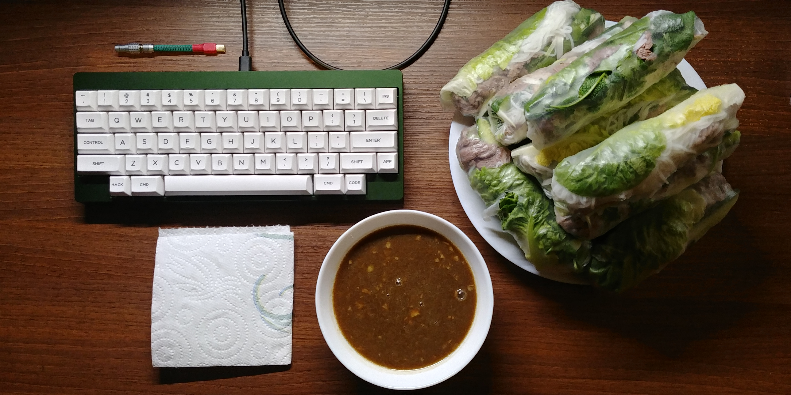

# Hoang M60-A QMK Keymap



## Default - Layer 0
```
 ,-----------------------------------------------------------------------------------------.
 | ` |  1  |  2  |  3  |  4  |  5  |  6  |  7  |  8  |  9  |  0  |  -  |  =  |  \  |  Ins  |
 |-----------------------------------------------------------------------------------------+
 | Tab    |  Q  |  W  |  E  |  R  |  T  |  Y  |  U  |  I  |  O  |  P  |  [  |  ]  |  Bksp  |
 |-----------------------------------------------------------------------------------------+
 | Ctrl    |  A  |  S  |  D  |  F  |  G  |  H  |  J  |  K  |  L  |  ;  |  '  |    Enter    |
 |-----------------------------------------------------------------------------------------+
 | Shift     |  Z  |  X  |  C  |  V  |  B  |  N  |  M  |  ,  |  .  |  /  | RShift   | Fn-1 |
 |-----------------------------------------------------------------------------------------+
         | Gui |    LAlt   |              SpaceFn             |   PrtSc   | Fn-2 |
         `-----------------------------------------------------------------------'
```
 ## SpaceFn - Layer 3
 This is the original HHKB FN layer.
 ```
 ,-----------------------------------------------------------------------------------------.
 |     | F1  | F2  | F3  | F4  | F5  | F6  | F7  | F8  | F9  | F10 | F11 | F12 |     |     |
 |-----------------------------------------------------------------------------------------+
 | Esc    |     |     |     |     |     |     | Home| End | PageUp| PageDown|    |   | Del |
 |-----------------------------------------------------------------------------------------+
 |         |     |     |     |     |     |     | Left| Down|  Up | Right |     |           |
 |-----------------------------------------------------------------------------------------+
 |           |     |     |     |     |     |     |     |      |    |     |           |     |
 |-----------------------------------------------------------------------------------------+
         |     |           |                                  |           |      |
         `-----------------------------------------------------------------------'
```
## M60-A - Layer 1
This layer is left untouched.

## M60-A - Layer 2
This layer is left untouched.

 ## Build
 Simply run `make rama/m60_a:hoang`